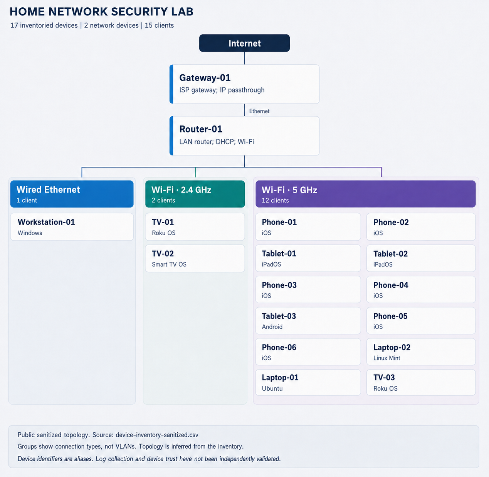

## SIEM-Control
I'll be using security and network principles for this project. I'll be focused on monitoring and detecting anomolies that appear on my network. The scope of this project is to gauge my understanding on SIEM principles and learn in my own environment. 

# Home Network Security Lab

An ongoing project to document a home network, establish a security baseline, and build toward centralized monitoring and incident response.

## Current stage

**Foundation.** An initial inventory, inventory-based topology, and Windows baseline are documented. Hardening validation, SIEM deployment, detection rules, and incident simulations remain planned. These artifacts describe observations; they do not establish that the network is secure.

## Work documented

- Inventoried 17 devices: two network devices and 15 clients.
- Documented wired, 2.4 GHz, and 5 GHz connectivity.
- Examined established TCP connections and listening services on a Windows workstation.
- Used service details to identify unfamiliar Intel and Razer services.
- Identified a VirtualBox host-only interface associated with a TCP listener.
- Recorded a limited DNS observation and reviewed Windows authentication events.

## Project artifacts

| Artifact | What it demonstrates |
| --- | --- |
| [Device inventory (CSV)](inventory/device-inventory-sanitized.csv) / [Excel](inventory/device-inventory-sanitized.xlsx) | Asset roles, OS families, connection types, and potential log availability |
| [Inventory field definitions](inventory/inventory-fields.md) | Data quality, privacy choices, and validation limits |
| [Network diagram](diagrams/network-topology-sanitized.png) | Inventory-based relationships and connection groups |
| [Security baseline](docs/security-baseline.md) | Observations, investigations, and unresolved questions |
| [Command reference](docs/baseline-command-reference.md) | Repeatable observation and investigation steps |
| [Service and interface identification](investigations/service-and-interface-identification.md) | How unfamiliar listeners were investigated |
| [Failed-logon review](investigations/failed-logon-review.md) | Authentication evidence and an explicitly unconfirmed cause |
| [Roadmap](docs/roadmap.md) | Planned progression from foundation to monitoring and response |
| [Data sanitization](docs/data-sanitization.md) | What is omitted from public artifacts |

## Lessons so far

Service names and network interfaces need context before they can be classified. Service details explained unfamiliar Intel and Razer processes, and adapter inspection identified the VirtualBox host-only network. A listening port alone did not establish internet exposure. A single failed logon did not establish a confirmed attack or a harmless cause.

## Scope and limitations

- The baseline is an initial observation, not continuous monitoring.
- TCP snapshots do not cover UDP endpoints.
- The network diagram is inferred from inventory. Connection groups are not VLANs or verified security boundaries.
- Potential log availability is recorded but collection has not been validated.
- Device trust has not been independently validated.
- Current documented tools include PowerShell, Wireshark, Windows Event Viewer, and Windows networking/service inspection. Future tools in the roadmap are not deployed-tool claims.

## Next steps

1. Resolve inventory uncertainties and verify the subnet mask privately.
2. Expand baseline observations and document collection context.
3. Review and record network and endpoint hardening.
4. Select one monitoring platform and verify event ingestion.
5. Build understandable detections and controlled investigation exercises.

## Privacy

Device identifiers are aliases. Real IP addresses, MAC addresses, personal ownership details, and raw evidence are omitted. Original records remain outside this public package. See [data sanitization](docs/data-sanitization.md).
